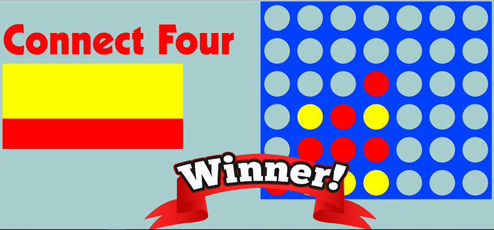

# Portfolio

## Connect 4

Connect Four is a front end project which uses JQuery Javascript syntax to deal with the logic of the game.

This project offered many challenges, including checking for victory Vertically, Horizontally and Diagonally. When a slot or hole has a certain class
javascript can view this as being occupied by a certain player depending on which class was added. So when a player has chosen a slot to enter add their player color, we can then loop through to see if a certain player has 4 in a row and then has won the game.

Diagonally is and was the greater challenge of this project, however sometimes the simpler solution is often the most elegant to review for fellow coders. Using an array to specify which combinations are in fact the winning combos, we can then use loops to loop through and search for 4 in a row which then find a winner diagonally.

